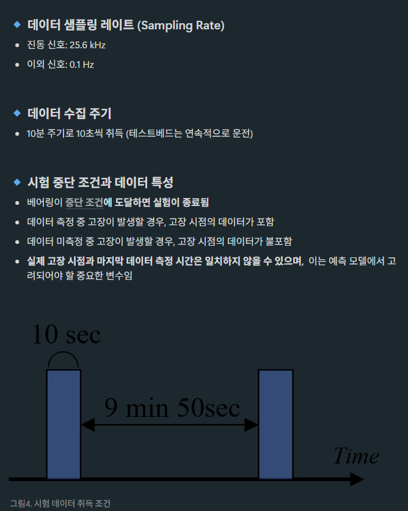
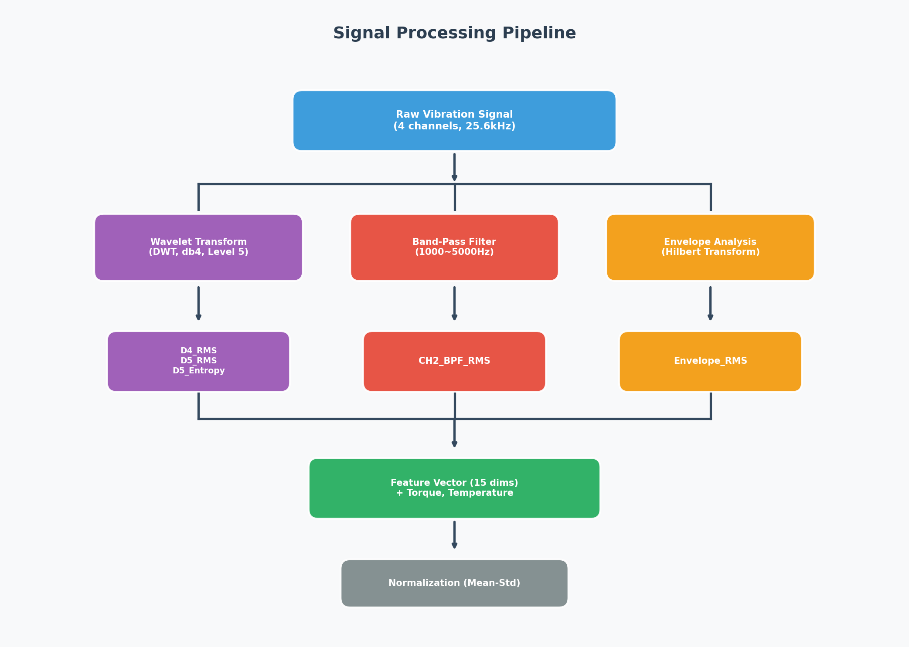
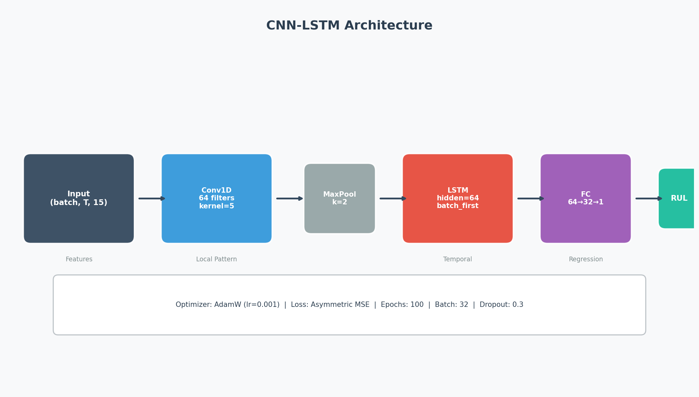
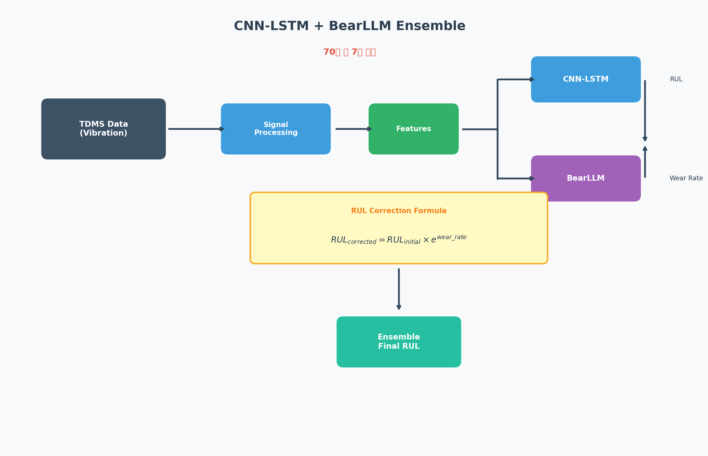

<div align="center">

# 🏆 RUL-Prediction-using-Bearing-Degradation-Data

### KSPHM-KIMM 2025 베어링 수명 예측 챌린지

[](https://python.org)
[](https://pytorch.org)
[](https://numpy.org)
[](https://scipy.org)
[](LICENSE)

<br>

**🏅 70팀 중 8등 달성** (성능 7등)


</div>

---

## 📋 목차

- [프로젝트 소개](#-프로젝트-소개)
- [주요 특징](#-주요-특징)
- [디렉토리 구조](#-디렉토리-구조)
- [설치 방법](#-설치-방법)
- [사용 방법](#-사용-방법)
- [방법론](#-방법론)
- [실험 결과](#-실험-결과)
- [Technical Report](#-technical-report)
- [참고문헌](#-참고문헌)
- [팀 정보](#-팀-정보)
- [라이센스](#-라이센스)

---

## 🎯 프로젝트 소개

본 프로젝트는 **KSPHM-KIMM 2025 데이터 챌린지**에서 베어링의 **잔여 수명(RUL, Remaining Useful Life)**을 예측하기 위해 개발되었습니다.

### 대회 개요

| 항목 | 내용 |
|:---:|:---|
| 🏛️ **주최** | KSPHM (한국PHM학회), KIMM (한국기계연구원) |
| 📅 **기간** | 2025년 4월 ~ 6월 |
| 🎯 **목표** | 진동 센서 데이터를 활용한 베어링 잔여 수명 예측 |
| 📊 **데이터** | TDMS 형식의 다채널 진동/온도/토크 시계열 데이터 |
| 🏆 **결과** | **70팀 중 8등** 달성 (성능 7등) |

### 대회 일정

| 진행 내용 | 날짜 |
|:---|:---:|
| 데이터 공개 1차 (Training Set) | 4/14 (월) |
| 팀 등록 마감 | 5/7 (수) |
| 데이터 공개 2차 (Validation Set) | 5/19 (월) |
| Validation 최종 제출 | 5/30 (금) |
| 결과 발표 | 6/3 (화) |
| 발표 평가 | 6/23 (월) |
| 우수 팀 시상 | 6/24 (화) |

<details>
<summary><b>📋 대회 조건 및 평가 기준 (클릭하여 펼치기)</b></summary>

<br>
<div align="center">

</div>

**평가 방식:**
- Validation Set에 대한 RUL 예측 정확도
- 발표 평가를 통한 최종 순위 결정

</details>

---

## ✨ 주요 특징

### 🔬 신호 처리 기법

- **Discrete Wavelet Transform (DWT)**
  - Daubechies 4 (db4) 웨이블릿 사용
  - D4, D5 스케일에서 RMS 및 Entropy 특징 추출
  - 저주파 대역의 결함 신호 효과적 분리

- **Band-Pass Filtering (BPF)**
  - 1000~5000Hz 대역 필터링
  - 고장 주파수 성분 분리 및 잡음 제거
  - CH2 채널에서 최적 성능 확인

- **Envelope Analysis**
  - Hilbert Transform 기반 포락선 분석
  - 충격 임펄스 신호의 주기적 패턴 검출
  - 결함 반복 주파수 추출

### 🧠 딥러닝 모델

- **CNN-LSTM Hybrid Architecture**
  - Conv1D: 시계열의 지역적 특징 추출
  - LSTM: 시간적 의존성 학습
  - Fully Connected: RUL 회귀 예측

---

## 📁 디렉토리 구조

```
📦 bearing/
├── 📂 data/
│   ├── 📂 Train Set/          # 학습용 TDMS 데이터
│   ├── 📂 Validation Set/      # 검증용 TDMS 데이터
│   └── 📂 submit/              # 제출 파일
├── 📂 model_weights/
│   └── 📜 best_model_0.66.pth  # 학습된 모델 가중치
├── 📂 src/
│   ├── 📂 preprocessing/       # 전처리 모듈
│   │   ├── 📜 feature_extraction.py
│   │   ├── 📜 signal_processing.py
│   │   └── 📜 data_loader.py
│   ├── 📂 models/              # 모델 정의
│   ├── 📂 analysis/            # 분석 도구
│   └── 📂 utils/               # 유틸리티
├── 📂 notebooks/               # Jupyter 노트북
├── 📂 configs/                 # 설정 파일
├── 📜 웨이블릿 및 fft,Envelope파라미터 추출_LSTM최종.py
├── 📜 KIST_베어링신의_제자들_code.ipynb
├── 📜 STFT(고장 주파수).ipynb
├── 📜 KIST 베어링 신의 제자들_report.pdf
└── 📜 README.md
```

---

## ⚙️ 설치 방법

### 요구사항

- Python 3.8+
- CUDA 11.0+ (GPU 사용 시)

### 설치

```bash
# 저장소 클론
git clone https://github.com/your-username/RUL-Prediction-using-Bearing-Degradation-Data.git
cd RUL-Prediction-using-Bearing-Degradation-Data

# 가상환경 생성 (권장)
python -m venv venv
source venv/bin/activate  # Linux/Mac
# venv\Scripts\activate   # Windows

# 의존성 설치
pip install -r requirements.txt
```

### 주요 라이브러리

| 라이브러리 | 버전 | 용도 |
|:---:|:---:|:---|
| `torch` | 2.0+ | 딥러닝 프레임워크 |
| `numpy` | 1.20+ | 수치 연산 |
| `pandas` | 1.3+ | 데이터 처리 |
| `scipy` | 1.7+ | 신호 처리 |
| `pywt` | 1.3+ | 웨이블릿 변환 |
| `nptdms` | 1.6+ | TDMS 파일 읽기 |
| `joblib` | 1.1+ | 병렬 처리 |
| `matplotlib` | 3.5+ | 시각화 |

---

## 🚀 사용 방법

### 1️⃣ 데이터 전처리

TDMS 파일에서 특징을 추출하고 CSV 형식으로 저장합니다.

```python
# 웨이블릿 및 fft,Envelope파라미터 추출_LSTM최종.py 실행
python "웨이블릿 및 fft,Envelope파라미터 추출_LSTM최종.py"
```

**주요 설정:**
```python
mode = "train"          # "train", "validation", "both" 중 선택
fs = 25600              # 샘플링 주파수 (Hz)
window_sec = 0.5        # 윈도우 크기 (초)
wavelet_function = "db4"  # 웨이블릿 함수
band_range = (1000, 5000) # 밴드패스 필터 범위
```

### 2️⃣ 모델 학습

```python
import torch
from models import CNNLSTM

# 모델 초기화
model = CNNLSTM(input_channels=15)

# 학습 설정
optimizer = torch.optim.Adam(model.parameters(), lr=1e-3)
criterion = torch.nn.MSELoss()

# 학습 루프
for epoch in range(epochs):
    for x_batch, y_batch in train_loader:
        optimizer.zero_grad()
        pred = model(x_batch)
        loss = criterion(pred, y_batch)
        loss.backward()
        optimizer.step()
```

### 3️⃣ 추론

```python
import torch
from models import CNNLSTM

# 모델 로드
model = CNNLSTM(input_channels=15)
model.load_state_dict(torch.load("./model_weights/best_model_0.66.pth"))
model.eval()

# 예측
with torch.no_grad():
    for x_test, fname in test_loader:
        pred = model(x_test)
        rul_sec = torch.expm1(pred).numpy()  # log 스케일 역변환
        print(f"{fname} → 예측 RUL: {rul_sec:.2f}초")
```

---

## 🔧 방법론

### Signal Processing Pipeline

<div align="center">

</div>

### CNN-LSTM Architecture

<div align="center">

</div>

### CNN-LSTM + BearLLM Ensemble Pipeline

본 프로젝트에서는 CNN-LSTM 모델과 사전학습된 BearLLM을 앙상블하여 더욱 정확한 RUL 예측을 수행합니다.

<div align="center">

</div>

**앙상블 방식:**
- **CNN-LSTM**: 초기 RUL 예측값 (`RUL_initial`) 생성
- **BearLLM**: 마모율 (Wear Rate) 추정
- **RUL 보정**: `RUL_corrected = RUL_initial × e^(wear_rate)`

### Feature Extraction Details

| 특징 | 설명 | 물리적 의미 |
|:---|:---|:---|
| `D4_RMS` | 웨이블릿 D4 스케일 RMS | 중고주파 대역 에너지 |
| `D5_RMS` | 웨이블릿 D5 스케일 RMS | 저주파 대역 에너지 |
| `D5_Entropy` | 웨이블릿 D5 스케일 엔트로피 | 신호 복잡도/불규칙성 |
| `CH2_BPF_RMS` | CH2 밴드패스 필터 후 RMS | 결함 주파수 대역 에너지 |
| `Envelope_RMS` | 포락선 분석 후 RMS | 충격 임펄스 강도 |

---

## 📊 실험 결과

### 검증 데이터셋 성능

| 데이터셋 | 예측 RUL (초) | 비고 |
|:---:|:---:|:---|
| Validation 1 | 51,730.23 | - |
| Validation 2 | 30,379.84 | - |

### 모델 학습 정보

| 항목 | 값 |
|:---|:---:|
| Best Validation Score | **0.66** |
| Input Features | 15 |
| Model Parameters | ~165KB |
| Training Device | CUDA GPU |

### 특징 선정 근거

- **CH2 채널 선정**: 모든 Train 파일에서 1000-5000Hz 대역에서 고장 시간에 가까워질수록 점진적으로 상승하는 패턴 확인
- **저주파 대역 (D4, D5)**: 베어링 결함 주파수(~140Hz)와 그 고조파가 해당 대역에 집중
- **Envelope 분석**: 결함에 의한 충격 신호의 반복 패턴을 효과적으로 검출

---

## 📝 Technical Report

프로젝트의 상세한 기술 보고서입니다.

<details>
<summary><b>📄 기술 보고서 보기 (클릭하여 펼치기)</b></summary>

<br>

**📥 다운로드:** [논문_한국어.pdf](논문_한국어.pdf)

**보고서 주요 내용:**
- 신호처리 파이프라인 상세 설명
- CNN-LSTM 모델 아키텍처 분석
- BearLLM 앙상블 방법론
- 실험 결과 및 분석
- 향후 연구 방향

| 섹션 | 내용 |
|:---|:---|
| 1. 서론 | 베어링 RUL 예측의 중요성 및 연구 배경 |
| 2. 관련 연구 | 기존 방법론 분석 및 한계점 |
| 3. 제안 방법 | CNN-LSTM + BearLLM 앙상블 아키텍처 |
| 4. 실험 | 데이터셋, 전처리, 학습 설정 |
| 5. 결과 | 성능 분석 및 비교 |
| 6. 결론 | 요약 및 향후 연구 방향 |

</details>

---

## 📚 참고문헌

1. Kumar et al. (2013), *"Wavelet transform for bearing condition monitoring and fault diagnosis: A review"*

2. Rafia Nishat Toma et al. (2020), *"Bearing Fault Classification of Induction Motors Using Discrete Wavelet Transform and Ensemble Machine Learning Algorithms"*

3. C K E Nizwana et al. (2016), *"A wavelet decomposition analysis of vibration signal for bearing fault detection"*

4. *"ANN Based Fault Detection Scheme for Bearing Condition Monitoring in SRIMs using FFT, DWT and Band-pass Filters"* - 밴드패스 필터 참고

5. *"음향방출 신호를 이용한 복합결함 특성분석"* - Envelope Analysis 참고

---

## 👥 팀 정보

<div align="center">

### 🏅 KIST 베어링 신의 제자들

| 이름 | 소속 | 역할 |
|:---:|:---|:---|
| **김진욱** | 서울과학기술대학교 | 신호처리 및 모델링 |
| **서승일** | 서울과학기술대학교 | 데이터 분석 및 특징 추출 |

</div>

---

## 📄 라이센스

이 프로젝트는 MIT 라이센스 하에 배포됩니다. 자세한 내용은 [LICENSE](LICENSE) 파일을 참조하세요.

```
MIT License

Copyright (c) 2025 KIST 베어링 신의 제자들

Permission is hereby granted, free of charge, to any person obtaining a copy
of this software and associated documentation files (the "Software"), to deal
in the Software without restriction, including without limitation the rights
to use, copy, modify, merge, publish, distribute, sublicense, and/or sell
copies of the Software, and to permit persons to whom the Software is
furnished to do so, subject to the following conditions:

The above copyright notice and this permission notice shall be included in all
copies or substantial portions of the Software.

THE SOFTWARE IS PROVIDED "AS IS", WITHOUT WARRANTY OF ANY KIND, EXPRESS OR
IMPLIED, INCLUDING BUT NOT LIMITED TO THE WARRANTIES OF MERCHANTABILITY,
FITNESS FOR A PARTICULAR PURPOSE AND NONINFRINGEMENT. IN NO EVENT SHALL THE
AUTHORS OR COPYRIGHT HOLDERS BE LIABLE FOR ANY CLAIM, DAMAGES OR OTHER
LIABILITY, WHETHER IN AN ACTION OF CONTRACT, TORT OR OTHERWISE, ARISING FROM,
OUT OF OR IN CONNECTION WITH THE SOFTWARE OR THE USE OR OTHER DEALINGS IN THE
SOFTWARE.
```

---

<div align="center">

**Made with ❤️ by KIST 베어링 신의 제자들**

[](https://github.com/your-username/RUL-Prediction-using-Bearing-Degradation-Data)

</div>
